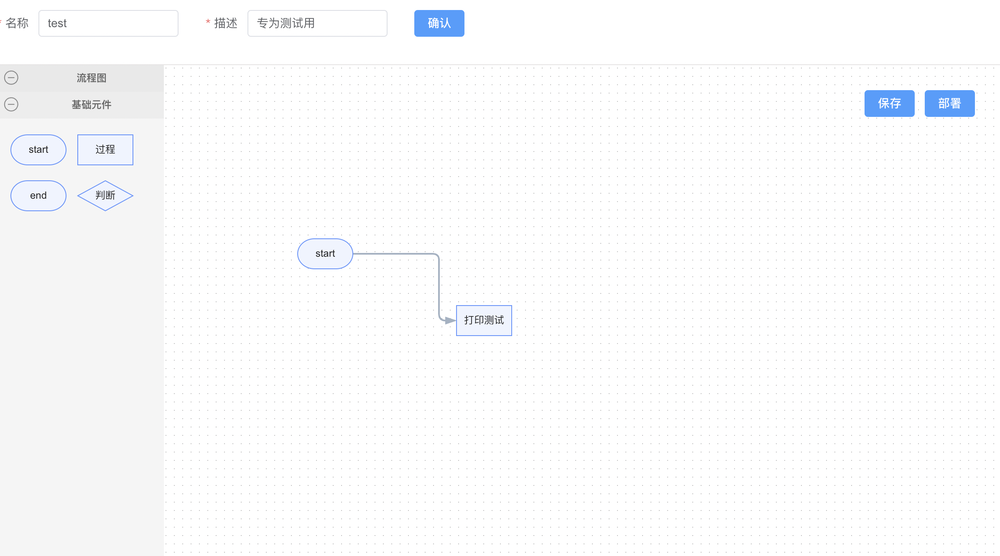
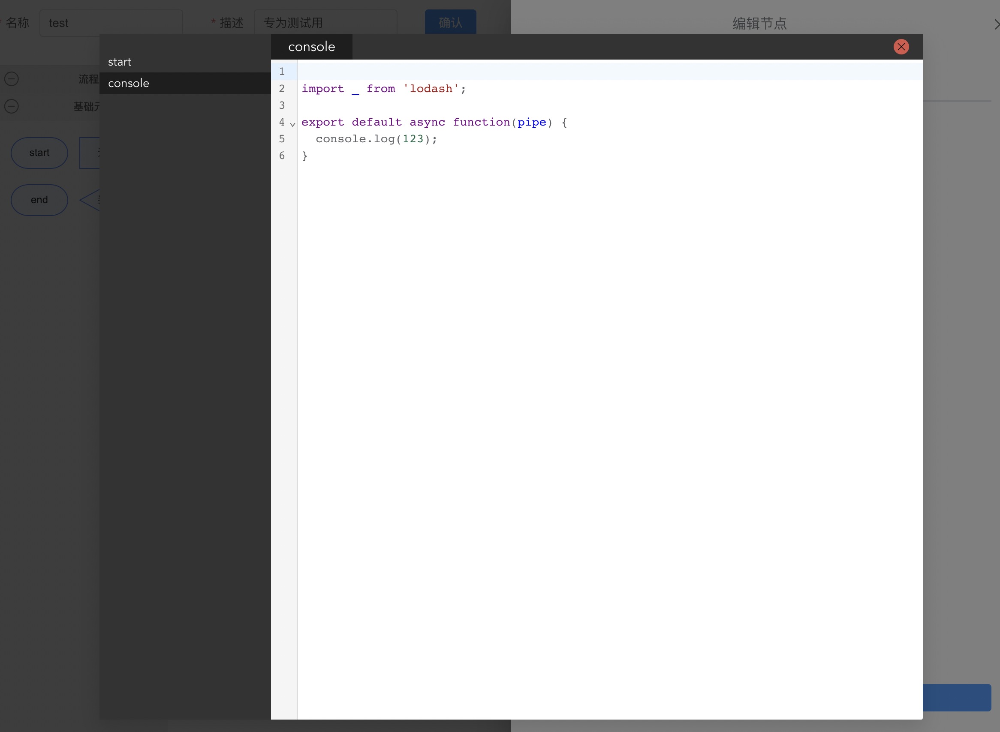

# lowcode

适合研发人员的低代码平台，目前开发中

## 组成部分:
1. vue 管理系统
2. server 服务端
3. core 流程调用
4. shared 公共基础

### 流程编辑使用的是antv/x6 蚂蚁团队的库
### 代码编辑使用的是codemirror6

## 介绍
1. lowcode主要是将业务的流程能够进行可视化编程。
2. lowcode的最终目标是强制开发者使用面向对象进行编程，通过流程来串联类(希望能到达这一步，路途很遥远)。


### vue管理系统
该子包主要进行流程编辑，将你的业务流程通过流程串联起来，你可以在界面上进行代码编写，并进行流程测试。然后部署成dsl保存起来




### core系统
该子包可供业务方调用生成的dsl流程，通过core提供的接口进行调用
```js
import { call } from "@lowcode/core";

// 格式:await call(流程名,参数1,参数2....)

await call('test',1,2)

```


### 节点函数
流程编辑将多个节点串联起来的时候，上一个节点的输出将作为下个节点的输入参数，如下
```
export async function(pipe,...args) {

}
```

其中pipe永远在第一个位置，pipe是一个流程中共享的全局类，每次开始的时候，会new 一个pipe。你可以调用pipe的函数，进行一些全局变量的设置，可以让流程里的所有节点都访问到
